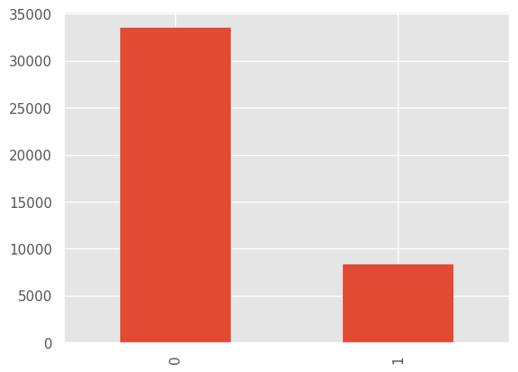
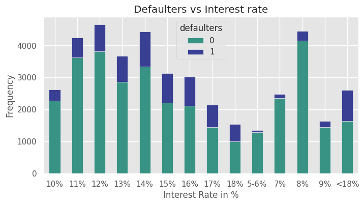
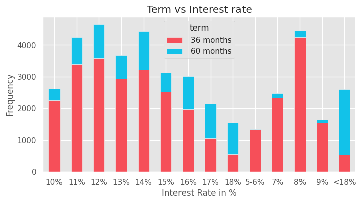
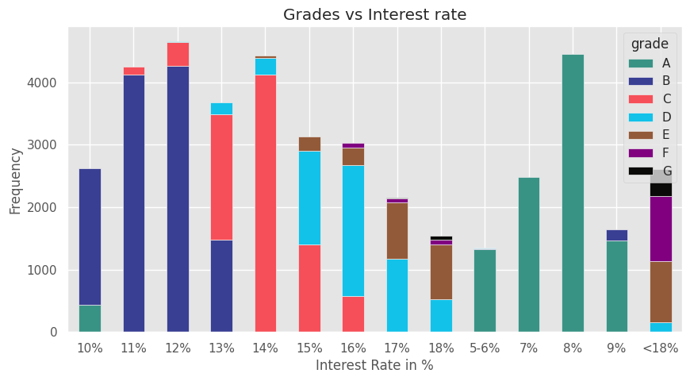
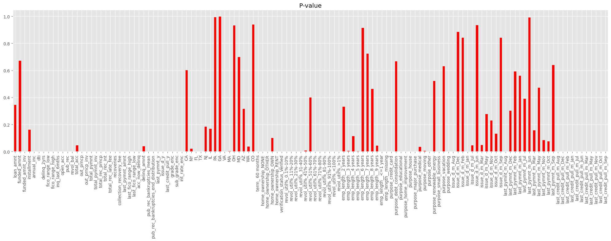
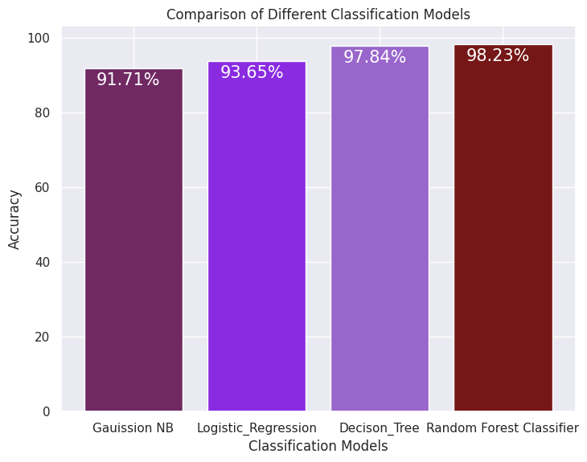

# leanding_loan_club_defaulters_prediction

### 1. **Objective**: Task is to determine if person is defaulter or not => Classification problem.

### 1.1 Data overview:
Number of data points: 42,538 
Attributes: 115 

### 1.2 Type of Machine learning problem
Task is to predict views of TED talk videos => Regression problem

### 1.3 Performance Metrics used
1. Accuracy
2. Confusion Matrix
3. Prcision , Recall & F1 Score

### 2. Exploratory Data Analysis 
#### 2.1 Distribution of target variable 

- Observation: Imbalanced Data

#### 2.1 Bivariate analysis on Interest Rate V/S Target variable (Defaulters)  

-  Observation: Even if we have imbalanced data people with higher interest rate tends to fall under defaulter category
  
#### 2.1 Bivariate analysis on Interest Rate V/S Month Term

- Observation: People with higher Interest rate tends to have 60 months term instead of 36

#### 2.3 Bivariate analysis on Interest Rate V/S Grades  (views) 

- Interest rate between 5-9 falls under A grade
- Interest rate between 10-12 falls under B grade
- Interest rate between 13-16 falls under C & D grade
- Interest rate greater than 17 has the risk of comming under Defaulters category i.e. Grade F&G

### 3. Feature Engineering
-  Unecessary variables which contains zip , id or only single category has been dropped
-  Features like Grade, Interst rate in %, sub_grade which holds higher information are been handled with Ordinal encoding.

### 4. Feature Selection

#### 4.1 f_regression to get feature importance, Dropped features with higher P-value with threshold > 0.3

### 5. Comparison of Accuracies on diffrent Machine learning Models used.
#### 1. Gaussion Naive Bayes
#### 2. Logistic Regression
#### 3. Decision Trees 
#### 4. Random Forest Classifier

### Conclusion & Buisness values
So after loading the data we started with EDA process to understand the data through diffrent types of Univariate,Bivariate & Multivaiate tools and also handles outliers and NaN values.
In feature engineering we have created some of the features as well as removed some unwanted features which added less value .
Features such as Grade, Sub_Grade, Intreset rate, term etc etc played major roles to understand wheather the person is defaulter or not.
Finally we have compared all the models w.r.t.o their Acc, Confusion Matrix , Precison & Recall and all the models have performed better in this case.

